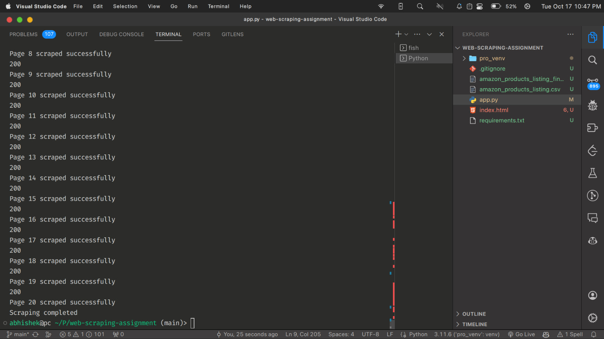
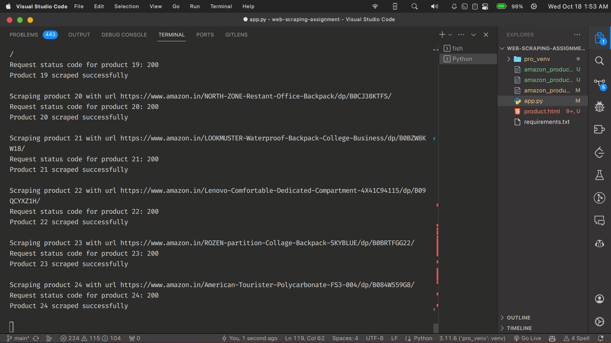

# Amazon web scraper

### Steps to run
- Clone the project

- Install dependencies
    - `pip install -r requirements.txt`
- Execute the script
    - `python app.py`

### Demos 
- Scraping the product catalogue

- Scraping the product details

